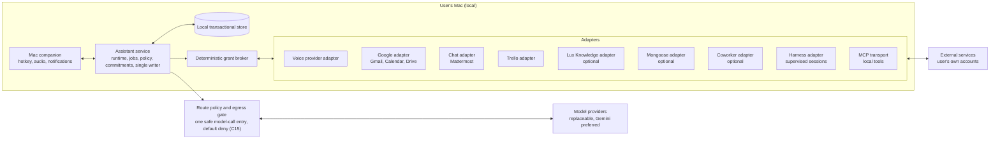
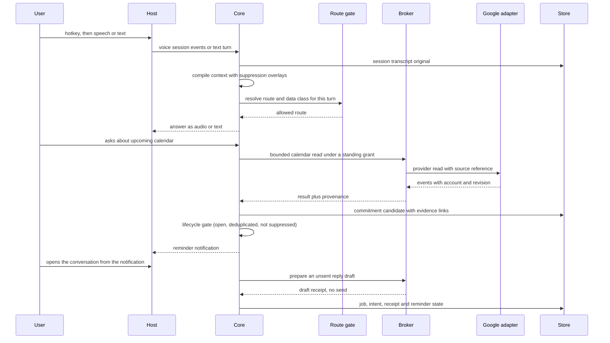

# Architecture (proposed)

Status: proposed design on a decided stack, partly built. The service stack is recorded in A01 (PLAN-R1): one authoritative service in TypeScript on Node with a SQLite store, a Swift Mac companion for native operating-system surfaces, and a responsive progressive web application as the portable client. A loopback service, a durable domain module, the web client and a thin Mac shell are implemented on main; [implementation-status.md](implementation-status.md) records exactly what is implemented, integrated, staged and unresolved. The components, data flow and directory seams described in this document are proposals to validate, not a description of a working system.

## Shape

The design is one authoritative service process plus client shells, with adapter modules around the service and one transactional application store. The service owns reasoning turns, durable jobs, storage, commitments, planning and policy, and it is the only writer. The Mac companion owns the native operating-system surfaces: global hotkey, microphone and playback, notifications, permissions dialogs. The same responsive shell is also hosted inside the Mac companion in its own web view (F23), and the companion does not duplicate business screens in SwiftUI. Whether the service is bound to the loopback interface or to a Linux virtual machine is a placement question, not a contract change. Adapters translate external systems into the versioned contracts the core consumes. One authoritative writer owns each entity or fact.

Every model call passes the route policy before a request starts, and the duplex voice session route is checked before any stream opens.

## First-loop data flow (proposed)

The first loop is one session in which the user asks about the calendar, a commitment is captured with evidence, a reminder is scheduled, the notification opens the conversation, and an unsent reply is prepared. The same session is recalled later, resolved, and never resurrected.

## Concrete invariants

These are the properties later implementation issues must preserve. Each one names the issue that owns it.

1. One authoritative writer per entity or fact. Didi owns its operational sessions, jobs, action receipts, commitment lifecycle, notification state and voice transcript originals. External providers keep ownership of their originals. Didi's own caches and read models are projections it owns; an optional retrieval service or a company knowledge service keeps its own authoritative knowledge rather than becoming a projection of Didi. (B01, C12)
2. Every source reference carries provider, account, source identity, revision or hash where available, and span where available, together with coverage, freshness and availability. (B01, B03)
3. A cached authorized source is an explicitly versioned cache, never a new source authority, and it says what it covers. (B03, B09)
4. Explicit typed preferences are the only mutable preference authority. Retrieved insights are evidence or history, never a second preference store. (B07)
5. Suppression overlays (resolved, cancelled, forgotten) are consulted before planning. Background extraction cannot silently reopen a closed item. (B08, D03)
6. Cancellation distinguishes stop playback, cancel a model turn, abort a running job, cancel queued jobs, and end a session. A dispatched effect with an unknown outcome is reconciled, never reported as canceled or no-effect, and never blindly retried. (A05, A08)
7. Reasoning text and tool results never create authority. Only a user grant does. (C12, C16)
8. Grants are per user, account, tool, action, resource and effect class. Changes are visible and revocable, and dispatch checks a live revocation state. (C12, C15, C17)
9. Secrets are held by the operating system credential store behind broker handles; subprocess environments are allowlisted. (C15, A13)
10. Processes running as the same operating system user are not an isolation boundary between each other. Broad shell or computer control is an explicit capability with honest residual risk. (A13, F12)
11. Provider egress is gated by a per-credential destination allowlist and a data class per payload on first use. The product states that the operator verifies their own provider agreement and never claims a data protection arrangement on the user's behalf. (C15)
12. Model calls do not happen on blind heartbeats. Synchronization is incremental, and due processing is event-driven or coalesced. (D07)
13. The store is transactional, jobs survive conversation end, and crash recovery uses an outbox and replayable transitions. (A04, A15)
14. No model identifier is hardcoded forever. Providers are replaceable and budgets are configured. (A06)
15. MCP is an interoperability adapter, not a permission system and not the internal API. (A14, C14)
16. The existing harness owns delegated coding worker lifecycle and admission. Didi does not reimplement scheduling, and ordinary calendar reads never route through a coding worker. (A09, A12)
17. The mobile companion never holds product authority. One Mac remains the authority while it is awake. While the Mac is asleep, closed or offline, nothing executes and nothing is sent, and the companion says so plainly. (F16, F17)
18. Notification display is not proof the user saw anything. Copy must not promise to bypass Focus without an entitlement the product may not have. (D10, F09)
19. Source failure is explicit. No fake empty success, no silent truncation; coverage and missing data are reported. (B03, C08)
20. User interface belongs to the native experience lane. Other lanes expose services and view models. (E master)
21. One completion graph. Every dependency edge in `depends_on` is a completion or integration prerequisite, never a prohibition on starting; lanes may begin against each other's fixtures, and [parallel-masters.md](parallel-masters.md) names which leaves start that way. (A02, A17)
22. Single safe model-call entry. No model call receives content before its route policy resolves; the initial posture is default-deny until policy is supplied, and model availability is never treated as approved data handling. (A06, C15)

## Proposed ownership seams

Directories are proposed seams, not an existing tree. Shared contract changes are proposed to the runtime lane (A), which sequences migration files; other lanes work against fixtures in parallel.

- A runtime owns the service stack record, versioned contracts, local service and store, durable jobs, model providers, tool turns, action receipts, harness adapters, MCP transport, diagnostics, the first daily-loop integration and lean validation gate, and measurement. Proposed paths: core/runtime, core/storage, core/jobs, adapters/harness, adapters/mcp-transport, contracts.
- B memory and persona owns the evidence model, transcript originals and resolution, recall, preferences, correction and suppression, consolidation, the persona specification and learning, the memory inspector and the recall evaluation corpus. Proposed paths: core/memory, core/persona, adapters/lux-knowledge, evals/memory, evals/persona.
- C accounts and trust owns account identity, the Google, chat, Trello and company adapters, policy and grants, the capability registry, egress, adverse security testing and revocation. Proposed paths: core/policy, core/identity, adapters/google, adapters/mattermost, adapters/trello, adapters/mongoose, adapters/coworker, evals/security.
- D commitments and proactivity owns the commitment lifecycle, extraction, prioritization, planning, reminders, interruption policy, follow-through and calibration. Proposed paths: core/commitments, core/planning, core/proactivity, evals/follow-through.
- E native experience owns the Mac host and surfaces, voice session plumbing, notifications, onboarding, review surfaces, computer control, packaging, the companion and portability. Proposed paths: apps/macos, adapters/voice, clients/mobile, platform.

## Evidence gaps

- The service stack is decided and is not reopened here. A01 records it; A19 implements the seam; C21 keeps one active authority epoch. What remains unproven is behaviour, not the choice.
- No latency or energy number has been measured. The numbers in [acceptance.md](acceptance.md) are proposals for A18 and the voice issues to falsify.
- Storage engine, transport and turn boundary choices are candidates, not selections.
- Whether any third-party component is retained is a licensing and maintenance decision reserved to A01, with a per-component licence and notice review before reuse.
- Full transcript retrieval from any existing private retrieval service is not assumed. B03 resolves originals through their providers when authorized and reports missing coverage.

## Portable deployment and clients

The same service process runs on the loopback interface when the laptop is the host and on a Linux
virtual machine when the host is moved. The client contract does not change between the two
placements. The deployment path, its runbook, its secret references and its backup and restore
procedure are described in [cloud-deployment.md](cloud-deployment.md); the contract the companion,
the browser client and the channel adapters share is described in
[client-service-contract.md](client-service-contract.md).

Two rules keep the portable path from eroding the local one:

- One active authority epoch per assistant (C21). There is no cloud and local multi-writer
  synchronisation, no last-writer-wins merge, and no silent transfer.
- A cloud process inherits no local operating-system authority. A device effect needs a
  device-specific grant, and the device pulls scoped, expiring intents and enforces its own local
  grants before it acts (C22).

Channels (Signal, email and Mattermost) are transports into the same service. They are not identity
proof and not an administrative bypass: a channel identity is bound to a source account only by an
explicit user action (C20).

The initial shape is one database per assistant. Instance isolation is a later question, not a first
requirement.

## Shared web interface and the native host

There is one web interface, not two. The same responsive orb and conversation surface is loaded by a
browser (F19) and displayed inside the Mac companion in its own web view (F23). The companion keeps
the surfaces that must be native: global hotkey, menu bar and window lifecycle, on-device speech,
notifications, the credential store and the outbound service client.

The web page is not an authority and there is no privileged bridge into the native process:

- No inbound JavaScript-to-native handlers and no generic native RPC. A page script that reaches for
  a native capability finds nothing to call.
- The page has its own scoped HttpOnly session cookie and a same-origin CSRF flow for browser
  pairing. The service bearer stays in the native credential store and never enters JavaScript.
- The web view uses a nonpersistent data store and loads only the exact configured origin, main
  frame, with no popups, downloads, subframes or arbitrary remote content.
- The page owns no operating-system permission. Screen capture, accessibility and automation grants
  belong to the native process, and same-user process separation is not a security sandbox.
- Speech starts and stops from a native control; recognised text travels through the service API and
  the page learns about it through its normal refresh and event stream.

Open questions about cookie persistence across a content-process termination and about losing a
graphics context are treated as test cases, not as facts. Only a test-owned surface may be
terminated, never a broad sweep of web content processes.
